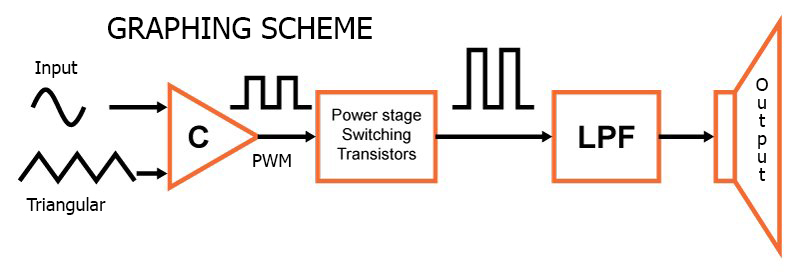

# ClassD-Amplifier

Class-D is the most efficient in audio amplifiers. It is also called a PWM amplifier by the use of pulse-width modulation. Use transistors turned on or off to spend less current (switching in two states (cutting and saturation) to regulate power input) . 
To be the best amplifier for any frequency band, the switching frequency is normally higher than 100kHz.
It can have an efficiency of 90% at full power, having a very low distortion. 

It has five main components. These are the triangular waveform generator (TWG),  the signal comparator, the power amplifier, the low pass filter and the speaker. 

  

- The signal comparator:
This block converts the input signal into a pulse sequence. To do that, the audio input signal is compared with a triangular waveform which frequency is (typically) tenth the analog input signal. It creates a PWM (pulse-width modulation) signal that is directed to a pair of high-power switches, typically MOSFETs.

- The power amplifier:
Here, we have two transistors (usually MOSFETs) which the counterphased is enabled or dissabled by the PWM waveform. When one of them is on, the current that runs through it is high, but the voltage is low.
On the other hand if the MOSFET is closed, the voltage that runs through is high, but the current is nearly zero. The output signal is still a PWM. 
In both cases no power dissipates. It only occurs during the state transitions of the MOSFETs

- The low pass filter:
It is a crucial element for the elaboration of a Class-D amplifier because so far we have a pulse sequence and we are not interested in sending a digital signal to a speaker. 
It suppresses switching noise without causing a distortion or loss of power, and provides us with a sinusoidal signal as the original one.

- The speaker:
This component allows us to listen to the amplified audio signal that we have entered. Its input is the sinusoidal signal that comes from the low pass filter.

